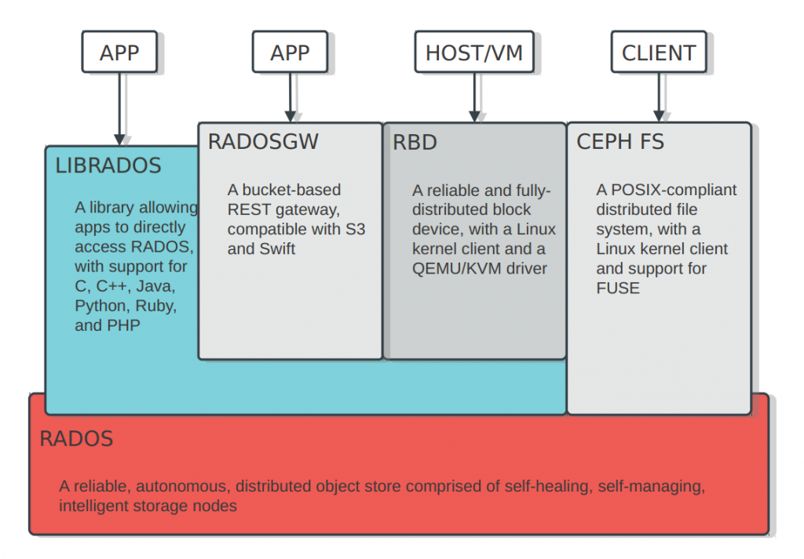

# ceph笔记

> [官方文档](https://docs.ceph.com/docs/master/start/)
>
> [架构和组件](https://docs.ceph.com/docs/bobtail/architecture/)

## 准备工作

### 机器配置

* 最少3个node，包含组件：
  * mon、mgr的可以只在1个node，但建议也扩到3个
  * osd对应每个node的每个磁盘/逻辑盘
  * mds，可选，提供cephfs，需要至少1个node，最好3个
  * rgw，可选，提供对象存储，可以在ceph node或客户端上创建rgw实例，每个实例可以指定端口号
* 可以有1个机器作为admin node，该机器也可以直接用上面3个之一，下面使用ceph1这个node作为admin node
* 每个机器除了系统以外的一个disk
* 最好有1个public一个cluster网卡
* 系统内核要求参考官方文档

### repo

参考kube文档nexus repo，使用阿里镜像

在admin节点`yum install ceph-deploy`

### ntp

略

### deploy user

在每个节点（下面的{username}不能是ceph，因为这个用户名被daemon用了，可以是edxi什么的）：

```bash
username="edxi"

sudo useradd -d /home/$username -m $username
sudo passwd $username

echo "$username ALL = (root) NOPASSWD:ALL" | sudo tee /etc/sudoers.d/$username
sudo chmod 0440 /etc/sudoers.d/$username
```

### 免密配置

在ceph1上用刚才创建的用户

```bash
ssh-keygen
# 一路会车

ssh-copy-id {username}@node1
ssh-copy-id {username}@node2
ssh-copy-id {username}@node3
```

### 防火墙

```text
# monitor node
sudo firewall-cmd --zone=public --add-service=ceph-mon --permanent

# OSDs and MDSs
sudo firewall-cmd --zone=public --add-service=ceph --permanent

firewall-cmd --reload
```

### selinux

```bash
setenforce 0
sed -i 's/^SELINUX=.*/SELINUX=permissive/' /etc/selinux/config
```

### admin node

如果执行ceph-deploy出现No module named pkg\_resources

```bash
yum install python-setuptools
```

### ntp

因为ceph要求时间一致性高，所以这里把ceph1当作时钟服务器

```bash
# 所有节点安装ntpd
yum -y install ntp ntpdate
cd /etc && mv ntp.conf ntp.conf.bak
```

ceph1的`vi` `/etc/ntp.conf`

```text
restrict 127.0.0.1 
restrict ::1 
restrict 10.184.101.0 mask 255.255.255.0 
server 127.127.1.0 
fudge 127.127.1.0 stratum 8
```

ceph1启动服务

```bash
systemctl start ntpd
systemctl enable ntpd
systemctl status ntpd
```

其他节点`vi /etc/ntp.conf`

```text
server ceph1
```

然后其他节点同步时间

```bash
ntpdate ceph1 #同步ceph1的时间
hwclock -w #写入硬件时钟，避免重启后失效
```

可以在其他node加个`crontab -e`

```text
*/10 * * * * /usr/sbin/ntpdate ceph1
```

## 安装群集

### 配置目录

在admin node上，使用之前创建的安装部署用户

```bash
mkdir my-cluster
cd my-cluster
```

ceph-deploy产生的配置文件都会放在这个目录，接下来所有操作都是这个用户在这个目录下执行

### 清理环境

可以下面命令清理环境（方便重新安装）

```bash
ceph-deploy purge {ceph-node} [{ceph-node}]
ceph-deploy purgedata {ceph-node} [{ceph-node}]
ceph-deploy forgetkeys
rm ceph.*
```

### 创建群集

创建初始配置

```bash
ceph-deploy new ceph1
# 可以直接ceph-deploy new ceph1 ceph2 ceph3
```

修改刚才生成的ceph.conf，增加public\_network,cluster\_network,mon\_allow\_pool\_delete配置

```text
[global]
fsid = a9ca5496-6a89-419f-88a4-eb7a75e9d6e2
mon_initial_members = ceph1
mon_host = 10.184.101.245
auth_cluster_required = cephx
auth_service_required = cephx
auth_client_required = cephx

public_network = 10.184.101.0/24
cluster_network = 192.168.1.0/24

[mon]
mon_allow_pool_delete = true
```

安装软件包

```bash
# 因为已经加过内部使用的repo，所以使用--no-adjust-repos参数直接使用现有repo
ceph-deploy install --no-adjust-repos ceph1 ceph2 ceph3
```

初始化mon节点并生成key

```bash
ceph-deploy mon create-initial
```

把key分发到所有节点（可选，在ceph节点用cli不需要指定mon地址和admin key）

```bash
ceph-deploy admin ceph1 ceph2 ceph3
```

部署mgr

```bash
ceph-deploy mgr create ceph1 # 也可以直接多个node
```

添加osd

```bash
# 有一些硬盘可能是以前Ceph集群里的数据盘或者曾经安装过操作系统，那么这些硬盘上很可能有未清理的分区，lsblk命令可以看到各个硬盘下是否有分区。假如/dev/sdb硬盘下发现有分区信息，可用如下命令清除
ceph-volume lvm zap /dev/sdb --destroy

# 添加osd
ceph-deploy osd create --data /dev/sdb ceph1
ceph-deploy osd create --data /dev/sdb ceph2
ceph-deploy osd create --data /dev/sdb ceph3

# 这里如果每个机器硬盘多，每个硬盘都要加，而且还要通过nvme硬盘做独立的wol和db，可以用类似下面脚本，参考https://bbs.huaweicloud.com/forum/thread-22721-1-1.html

# 把nvme分区脚本partition.sh
#!/bin/bash
parted /dev/nvme0n0 mklabel gpt
for j in `seq 1 12`
do
((b = $(( $j * 8 ))))
((a = $(( $b - 8 ))))
((c = $(( $b - 6 ))))
str="%"
echo $a
echo $b
echo $c
parted /dev/nvme0n0 mkpart primary ${a}${str} ${c}${str}
parted /dev/nvme0n0 mkpart primary ${c}${str} ${b}${str}
done

# create_osd.sh脚本
#!/bin/bash
for node in ceph1 ceph2 ceph3
do
j=1
k=2
for i in {a..l}
do
ceph-deploy osd create ${node} --data /dev/sd${i} --block-wal /dev/nvme0n0p${j} --block-db /dev/nvme0n0p${k}
((j=${j}+2))
((k=${k}+2))
sleep 3
done
done
```

检查群集状态\(root用户在任意node运行\)

```bash
sudo ceph health
sudo ceph -s
sudo ceph quorum_status --format json-pretty
```

#### 部署mds

如果需要cephfs，需要部署mds节点

```bash
ceph-deploy mds create ceph1

# 检查状态
ceph mds stat
ceph fs
```

### 扩展群集

上面的mon、mgr和mds可以扩展到所有3个node上

```bash
# 扩mon
ceph-deploy mon add ceph2 ceph3
# 扩展以后可以修改ceph.conf，加上新的mon主机名和ip，用逗号分隔，然后重新分发下管理配置
ceph-deploy --overwrite-conf admin ceph1 ceph2 ceph3

# 扩mgr
ceph-deploy mgr create ceph2
ceph-deploy mgr create ceph3

# 扩mds
ceph-deploy mds create ceph2 ceph3
```

### 状态检查

```bash
ceph status
ceph osd status
ceph osd df
ceph osd utilization
ceph osd pool stats
ceph osd tree
ceph pg stat
```

## 使用

### 应用存储使用架构图



### pool、pg、crush和ec

* pool就是最终放数据的地方
  * 创建pool须要设置pg，通过pg使用osd，怎样创建pool可以使用[pgcalc](https://ceph.com/pgcalc/)计算，相关的算法和osd对应关系参考[官方文档](https://docs.ceph.com/docs/mimic/rados/operations/placement-groups/)，nautilus版本后支持[pg\_autoscale\_mode](https://docs.ceph.com/docs/master/rados/operations/placement-groups/#autoscaling-placement-groups)
  * 后面的rados/radosgw/rbd/cephfs等使用最终也就是读写pool
* 通过crush来控制存储到的osd，比如可以指定数据要分布在`2个机房的1列机柜的3个主机的一块盘上`，具体算法策略设置参考 [官方文档](https://docs.ceph.com/docs/master/rados/operations/crush-map/)
* 可以设置ec profile来给pool提供[纠错](https://docs.ceph.com/docs/master/rados/operations/erasure-code/)

### 对象存储\(rados\)

这里按照官方文档[存储和获取对象数据](https://docs.ceph.com/docs/master/start/quick-ceph-deploy/#storing-retrieving-object-data)创建一个pool，并在上面存放对象。没有从客户端访问，也没有创建用户访问。

```bash
echo {Test-data} > testfile.txt
ceph osd pool create mytest
rados put {object-name} {file-path} --pool=mytest
rados put test-object-1 testfile.txt --pool=mytest

# To verify that the Ceph Storage Cluster stored the object, execute the following:

rados -p mytest ls

# Now, identify the object location:

ceph osd map {pool-name} {object-name}
ceph osd map mytest test-object-1

# Ceph should output the object’s location. For example:
# osdmap e537 pool 'mytest' (1) object 'test-object-1' -> pg 1.d1743484 (1.4) -> up [1,0] acting [1,0]

# To remove the test object, simply delete it using the rados rm command.
# For example:

rados rm test-object-1 --pool=mytest

# To delete the mytest pool:

ceph osd pool rm mytest mytest --yes-i-really-mean-it

# 有了pool就可以看使用大小了
ceph df
```

pool可以通过`ceph osd pool set-quota`设置大小，cephfs则使用对每个目录设置[quotas](https://docs.ceph.com/docs/master/cephfs/quota/)

### 用户管理

> [官方用户管理文档](https://docs.ceph.com/docs/master/rados/operations/user-management/#)

```bash
# 创建用户
查看并创建test用户
ceph auth get-or-create client.test mon 'allow r' osd 'allow rwx pool=abc_pool'

记录admin用户key
ceph auth get-key client.admin


##如果需要修改test用户权限，可执行下命令
ceph auth caps client.test mon 'allow r' osd 'allow rwx pool=rbd'

#查看用户秘钥
ceph auth get-key client.admin

#查询用户权限
ceph auth get client.admin

#查看全部用户
ceph auth list

#建议在ceph client上把配置文件和需要使用的key复制上去，可以使用之前的ceph-deploy admin，可以用下面命令导入用户（可以之后在客户端删除admin keyring，但像kubernetes的ceph provisioner只有不需要用admin keyring的，因为已经在secret里配置了）
ceph auth get client.kubeuser1 -o /etc/ceph/ceph.client.kubeuser1.keyring
```

下面用到的块存储\(rbd\)和cephfs都是从客户端访问的，所以最好配置好客户端电脑环境和创建好对应权限的用户。s3对象存储\(rgw\)使用的是`radosgw-admin user create`创建的用户

### 块存储\(rbd\)

```bash
# 需要先创建好rbd pool，可以用下面两种方式创建
ceph osd pool create rbd # 这里最好按照pgcalc填入pg数量
rbd pool init rbd # rbd命令假设默认的pool名是rbd，如果使用的是其他pool，需要在rbd命令后面跟上pool名，比如rbd ls foo-pool

# 创建块设备镜像
rbd create foo --size 4096 --image-feature layering
rbd info foo
rados -p rbd ls

# 映射镜像到块设备
sudo rbd map foo --name client.admin

# 使用块设备创建文件系统
sudo mkfs.ext4 -m0 /dev/rbd/rbd/foo

# 挂载使用
sudo mkdir /mnt/ceph-block-device
sudo mount /dev/rbd/rbd/foo /mnt/ceph-block-device
cd /mnt/ceph-block-device
echo 'hello ceph block storage' > testfile.txt

# 清理
cd ~
sudo umount -lf /mnt/ceph-block-device
sudo rbd unmap foo
rbd remove foo # k8s的ceph rbd provisioner在ceph pool quota满的时候会不能正常删除pv，手动删除pv不能对应删除image，这时候可以用这个命令删除
rados -p rbd ls
```

### cephfs

```bash
# 创建
ceph osd pool create cephfs_data 32 # 客户端挂载后看到的就是这个pool大小，cephfs quota可以对目录级别设置quota，但这个设置对k8s cephfs provisioner无效
ceph osd pool create cephfs_meta 32
ceph fs new mycephfs cephfs_meta cephfs_data # 只能创建一个cephfs，启用experimental，可以创建多个cephfs，说明可能以后版本支持多个cephfs
ceph fs ls

# kernel driver挂载
mount -t ceph :/ /mnt/mycephfs -o name=admin 
# ceph-fuse挂载
yum install ceph-fuse -y
ceph-fuse /mnt/mycephfs

# 删除cephfs
ceph fs fail mycephfs
ceph fs rm mycephfs --yes-i-really-mean-it
```

